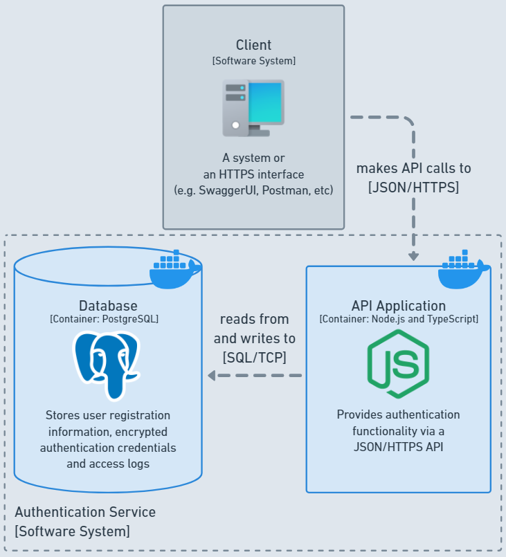

# Node.js Authentication Service

  

## About
REST API service to authenticate users.

### Built with

[![Node.js][nodejs-badge]][nodejs-url]
[![JavaScript][javascript-badge]][javascript-url]
[![PostgreSQL][postgresql-badge]][postgresql-url]
[![Docker][docker-badge]][docker-url]

(<a href="#nodejs-authentication-service">back to top ⬆️</a>)

## Getting started

### Prerequisites

### Installation

(<a href="#nodejs-authentication-service">back to top ⬆️</a>)

## Usage

(<a href="#nodejs-authentication-service">back to top ⬆️</a>)

## Roadmap or Tasks?

|⭕ To Do |✴️ Doing |✅ Done |
|:-:|:-:|:-:|
||||

(<a href="#nodejs-authentication-service">back to top ⬆️</a>)

## Acknowledgments
<ul>
  <li>
    <a target="_blank" href="https://www.youtube.com/watch?v=sTUbOGf9V1U">How to build a Back-end portfolio?</a>
  </li>
  <li>
    <a target="_blank" href="https://c4model.com/">The C4 model</a>
  </li>
  <li>
    Diagrams made with <a target="_blank" href="https://whimsical.com/">Whimsical</a>
  </li>
  <li>
    <a target="_blank" href="https://icons8.com/icon/hsPbhkOH4FMe/node-js">Node.js</a>, 
    <a target="_blank" href="https://icons8.com/icon/cdYUlRaag9G9/docker">Docker</a>, 
    <a target="_blank" href="https://icons8.com/icon/38561/postgresql">PostgreSQL</a> and 
    <a target="_blank" href="https://icons8.com/icon/Qh2tCGOAtV52/workstation">Computer</a>
    icons by <a target="_blank" href="https://icons8.com">Icons8</a>
  </li>
  <li>
    <a target="_blank" href="https://www.youtube.com/watch?v=xR4D2bp8_S0">Node.js in 2022 || Creating & Testing a Complete Node.js Rest API || No Framework || Erick Wendel</a>
  </li>
  <li>
    <a target="_blank" href="https://github.com/othneildrew/Best-README-Template">Best README Template</a>
  </li>
</ul>

(<a href="#nodejs-authentication-service">back to top ⬆️</a>)

<!-- Markdown links and images -->
[nodejs-badge]: https://img.shields.io/badge/Node.js-3C873A?style=for-the-badge&logo=node.js&logoColor=white
[nodejs-url]: https://nodejs.org/en
[javascript-badge]: https://img.shields.io/badge/JavaScript-FFD600?style=for-the-badge&logo=javascript&logoColor=black
[javascript-url]: https://developer.mozilla.org/en-US/docs/Web/JavaScript
[postgresql-badge]: https://img.shields.io/badge/PostgreSQL-0064a5?style=for-the-badge&logo=postgresql&logoColor=white
[postgresql-url]: https://www.postgresql.org/
[docker-badge]: https://img.shields.io/badge/Docker-0db7ed?style=for-the-badge&logo=docker&logoColor=white
[docker-url]: https://www.docker.com/