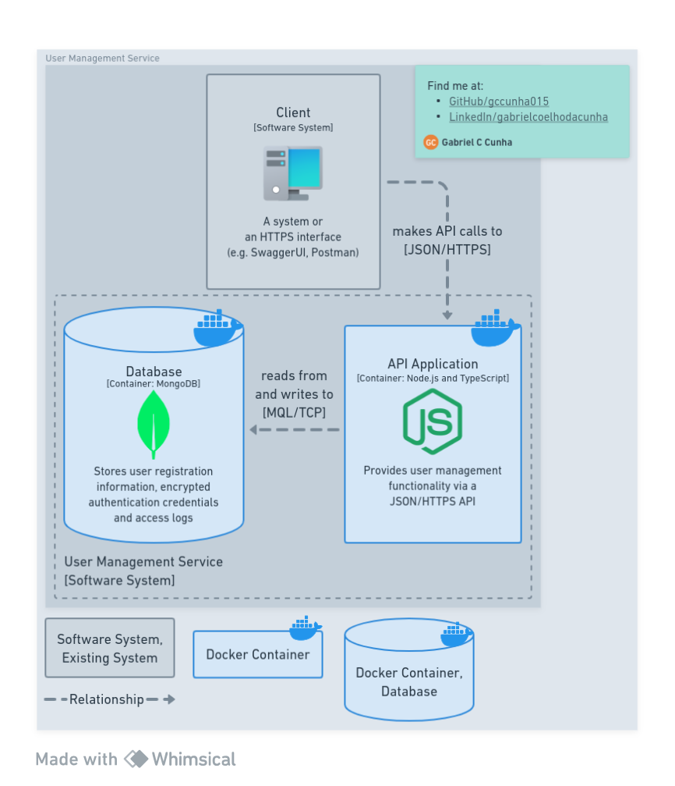

# Node.js Authentication Service

  

## About

REST API service to authenticate users.

### Built with

[![Node.js][nodejs-badge]][nodejs-url]
[![TypeScript][typescript-badge]][typescript-url]
[![PostgreSQL][postgresql-badge]][postgresql-url]
[![Docker][docker-badge]][docker-url]

(<a href="#nodejs-authentication-service">back to top ⬆️</a>)

## Getting started

### Prerequisites

### Installation

(<a href="#nodejs-authentication-service">back to top ⬆️</a>)

## Usage

(<a href="#nodejs-authentication-service">back to top ⬆️</a>)

## Roadmap

<ul type="none">
  <li>✅ Add C4 container diagram</li>
  <li>⬜ Define database schema
    <ul type="none">
      <li>✅ users</li>
      <li>⬜ sessions</li>
      <li>⬜ users_logs</li>
      <li>⬜ sessions_logs</li>
      <li>⬜ log_actions</li>
      <li>⬜ log_actions_logs</li>
    </ul>
  </li>
  <li>⬜ Implement, test and document API
    <ul type="none">
      <li>⬜ User routes
        <ul type="none">
          <li>⬜ Unit testing</li>
          <li>⬜ Integration testing with Server</li>
        </ul>
      </li>
      <li>⬜ Add Swagger on route <code>/docs</code></li>
    </ul>
  </li>
  <li>⬜ Add C4 deploy diagram</li>
  <li>⬜ Deploy demo</li>
</ul>

(<a href="#nodejs-authentication-service">back to top ⬆️</a>)

## Acknowledgments

- [How to build a Back-end portfolio?]
- [The C4 model]
- Diagrams made with [Whimsical]
- [Node.js][icons8-nodejs], [Docker][icons8-docker], [PostgreSQL][icons8-postgresql] and [Computer][icons8-computer] icons by [Icons8]
- [Node.js in 2022 || Creating & Testing a Complete Node.js Rest API || No Framework || Erick Wendel][erick-wendel-1]
- [Best README Template]
- [How to create a WebAPI with Node.js, Express and Typescript][luiz-tools-1]
- [Build Node.js User Authentication - Password Login][web-dev-simplified-1]

(<a href="#nodejs-authentication-service">back to top ⬆️</a>)

<!-- Markdown links and images -->

[nodejs-badge]: https://img.shields.io/badge/Node.js-3C873A?style=for-the-badge&logo=node.js&logoColor=white
[nodejs-url]: https://nodejs.org/en
[typescript-badge]: https://img.shields.io/badge/TypeScript-358EF1?style=for-the-badge&logo=typescript&logoColor=white
[typescript-url]: https://www.typescriptlang.org/
[postgresql-badge]: https://img.shields.io/badge/PostgreSQL-0064a5?style=for-the-badge&logo=postgresql&logoColor=white
[postgresql-url]: https://www.postgresql.org/
[docker-badge]: https://img.shields.io/badge/Docker-0db7ed?style=for-the-badge&logo=docker&logoColor=white
[docker-url]: https://www.docker.com/
[How to build a Back-end portfolio?]: https://www.youtube.com/watch?v=sTUbOGf9V1U
[The C4 model]: https://c4model.com/
[Whimsical]: https://whimsical.com/
[icons8-nodejs]: https://icons8.com/icon/hsPbhkOH4FMe/node-js
[icons8-docker]: https://icons8.com/icon/cdYUlRaag9G9/docker
[icons8-postgresql]: https://icons8.com/icon/38561/postgresql
[icons8-computer]: https://icons8.com/icon/Qh2tCGOAtV52/workstation
[Icons8]: https://icons8.com
[erick-wendel-1]: https://www.youtube.com/watch?v=xR4D2bp8_S0
[Best README Template]: https://github.com/othneildrew/Best-README-Template
[luiz-tools-1]: https://www.luiztools.com.br/post/como-criar-uma-webapi-com-node-js-express-e-typescript/
[web-dev-simplified-1]: https://www.youtube.com/watch?v=Ud5xKCYQTjM
